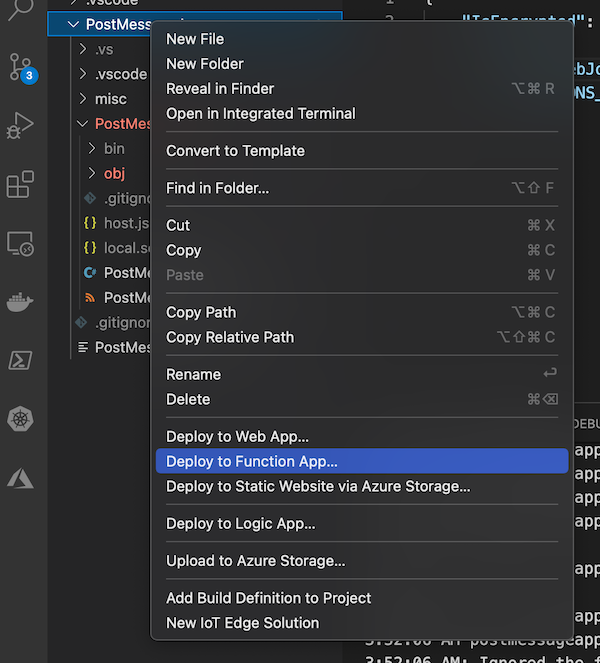
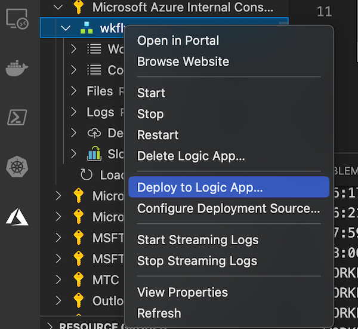
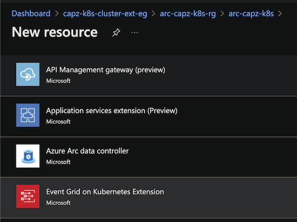
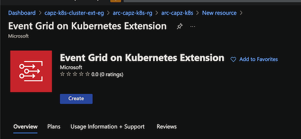
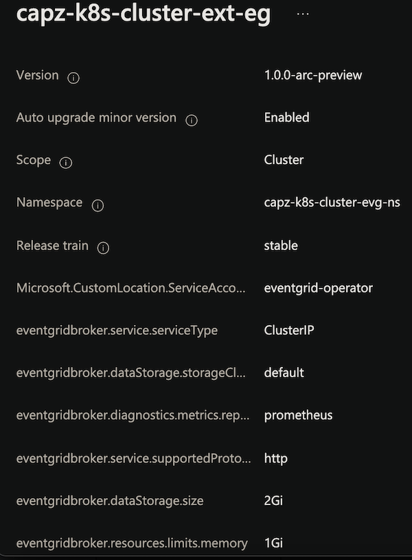

# Deploy Cloud Native Apps - CAPZ K8s Cluster (WIP)

## Introduction

The purpose of this document is to guide users to *Deploy* various *Cloud Native Applications* onto a <u>*Un-managed K8s cluster*</u>. The Un-managed cluster can be any standard K8s cluster but the document uses **Cluster API Provider for Azure - *https://github.com/kubernetes-sigs/cluster-api-provider-azure*** as it is easy to get the basic infrastructure of K8s from Azure - *VMs, Load Balancers, Networks* etc. You are free to choose your own!

Now for deploying Cloud Native Applications on to K8s - we would use *Azure Arc for Kubernetes* as the service. This would help us to still work with our applications as-is on Cloud *(App Services, Functions, Logic Apps, Message Brokers like EventGrid* etc.) yet you can run it anywhere - be it on a *Managed Cluster like AKS* or an *Un-managed cluster like this one* Or *K8s clusters on any other Cloud* Or even *K8s bare metal clusters*

### What the Document does

- Deep dive on Azure Arc for K8s
- Create an Un-managed cluster using CAPZ templates
- Installs all Providers and Extensions needed by Azure Arc for K8s
- Creates and Deploys a sample Web App in NodeJs onto the CAPZ cluster
- Creates and Deploys a sample Function App in .NetCore onto the CAPZ cluster
- Creates and Deploys a sample Logic App workflow onto the CAPZ cluster
- Create an EventGerid Topic on Azure and Subscribes for any of the above services e.g. *Function App Endpoint*.
  - Deploys any sample application onto CAPZ cluster - e.g. *Nginx server*
  - Get inside the application Pod and executes CURL command to post a message onto the EventGrid endpoint
  - Check that the corresponding Subscription Endpoint (e.g. *Function App*) is fired!

### What the Document does NOT

- Go thru the details of CAPZ cluster creation
- Explain the templates of CAPZ
- Deep dive on K8s
- Deep dive on Azure Arc


### Repository Structure

#### Deployments

- ##### Helms

  - Contains helm charts for any deployment that user may want to do on the CAPZ cluster
  - For this exercise, only persistent volume is needed - **pv-chart**
    - **values-eg.yaml** - This is to deploy PersistentVolume for EventGrid - this would be explained later
    - **values-fs.yaml** - This is to deploy PersistentVolume for App Services - this would be explained later

- ##### Setup

  - All files that would be used during creation of CAPZ cluster; including the *Cluster Configuration* file
  
  - **KubeConfig** file to be generated by CAPZ runtime and to be used throighout this exercise to connect to the cluster

### Pre-requisites, Assumptions

- Knowledge on Containers, Serverless Functions, Logic App - *L200+*
- Knowledge on K8s  - *L200+*
- Knoweldge on VSCode; Deploying applications throigh VSCode - L200+
- Some knowledge on Azure tools & services viz. *Azure CLI, KeyVault, VNET* etc. would help

### Plan

- #### Create Jump Server resources

  - **master-workshop-rg**

    - **Virtual Network and Subnets** - Hosting *Jump Server*

    - **Jump Server VM**

      - Run through all commands to Create and Connect to the cluster

      - Run through all commands to configuere Cluster for Azure Arc

      - Run through all commands to deploy applications onto the Cluster

        

- #### Seggregate the workload into 3 Resource Groups as per the usage

  - **capz-workshop-rg**

    - Contains all Infrastructure components and services of the CAPZ cluster
      - **Master Node VM** - Control Pane of K8s
      - **Worker Node VMs** - 3 VMs to host app workloads
      - **Virtual Network and Subnets** - Hosting K8s cluster Nodes - *Master, Worker* and *Jump Server*
      - **Load Balancers** - Load Balancers for all the above VMs - Master and Worker
      - **NSGs** - for both Master Subnet and Worker Subnet
      - **Disks**
        - OS Disks - Master and Worker Nodes
        - ETCD Disks - Master Node

  - **arc-k8s-rg**

    - Contains Azure Arc components for K8s

      - ##### **Arc Connected Cluster** for the CAPZ cluster.

        - Establishes a connectivity to API Server running on K8s Control Plane 9Master Node) and ensures Arc is managing the k8s cluter on Azure

      - ##### **CustomLocation**

        - Acts as the Target location for deploying application and Data service instances on the k8s cluster. 
        - Each cluster would need one or more Custom Locations
        - Each **CustomLocation** can host multiple app and data instances
        - To be explained later in details

      - ##### App Service Kubernetes environment

        - Enables configuration common to apps in the custom location
        
        - This is required before any apps are deployed onto the cluster
        
          
  
  - **arc-services-rg**
  
    - Contains all microservices to be deployed onto K8s Cluster
      - **HelloJSApp**
      - **PostMessage** Function App
      - **Workflow** Logic App
      - **NotifyTopic** Event Grid Topic
      
      

### Action - Step-By-Step

#### Management Resources

- **Create** Management Resource Group

  ```bash
  az group create -l eastus -n master-workshop-rg
  ```

-  **Create** VNet and SubNet for Jump Server VM

- **Create** a Jump Server VM - preferred is Windows VM so that all visualisation tools like **Lens** etc. can be used to view the cluster status at runtime. The one used for this workshop was - 

   - OS - **Windows Server 2019 DC - v1809**
   - Size  - **Standard DS2 v2 (2 vcpus, 7 GiB memory)**

4. **RDP** to the *Windows VM*

5. **Install** following tools for creation and management of the cluster and its associated resources

   1. (Optional) **Chocolatey**

      ```bash
      # Follow this link and install Chocolatey latest
      https://chocolatey.org/install
      ```

   2. **Azure CLI**

      ```bash
      # Follow this link and install Azure CLI latest
      https://docs.microsoft.com/en-us/cli/azure/install-azure-cli-windows?tabs=azure-cli
      ```

   3. **Kubectl**

      ```bash
      choco install kubernetes-cli
      
      # Otherwise, follow the various options at -
      https://kubernetes.io/docs/tasks/tools/install-kubectl-windows/ 
      ```

   4. (Optional) **Helm**

      ```
      choco install kubernetes-helm
      ```

   5. (Optional) **PowerShell Core**

      ```bash
      # Follow this link and install PowerShell Core for Windows
      https://docs.microsoft.com/en-us/powershell/scripting/install/installing-powershell-core-on-windows?view=powershell-7.1
      
      # Install Az module for communicating to Azure over Az cmdlet
      Install-Module -Name Az -AllowClobber
      ```

   6. (Optional) **Infra App** - *For monitoring Cluster resources*

      ```bash
      # Follow this link and install Lens for Windows
      https://infra.app/
      ```

   7. (Optional) **Visual Studio Code**

      ```bash
      # Follow this link and install Visual Studio Code
      # This is for better management of scripts and commands
      https://code.visualstudio.com/docs/setup/windows
      ```

   8. (*Optional*) **Docker**

      ```bash
      # Follow this link and install Docker Desktop latest for Windows
      https://docs.docker.com/docker-for-windows/install/
      
      # Install this only if you want to play with Docker images locally
      # This workshop will use a different techniqe so installation of Docker is not needed
      ```

6. The **Jump Server** is now ready to be used for subsequent deployments

   

#### Working Resources

## <u>Architecture Diagram - CAPZ - TBD</u>


1. **Set CLI** variables for easy usage and reference

   ```bash
   tenantId="<tenant_Id>"
   subscriptionId="<subscription_Id>"
   capzResourceGroup="capz-k8s-rg"
   arcK8sResourceGroup="arc-capz-k8s-rg"
   arcSvcResourceGroup="arc-capz-services-rg"
   clusterName="capz-k8s-cluster"
   location="eastus"
   baseFolderPath="<root_folder_path>/Deployments"
   ```

2. **Login** to Azure

   ```bash
   az login --tenant $tenantId
   ```

3. **Create** *Resource Groups* as described in the **Plan** section

   ```bash
   az group create -l eastus -n $capzResourceGroup
   az group create -l eastus -n $arcK8sResourceGroup
   az group create -l eastus -n $arcSvcResourceGroup
   
   ```

4. **Deploy** Management Cluster for CAPZ

   - **Kind** would be used for this exercise as it is very easy to set up!

   - Any K8s cluster can be used management cluster for CAPZ

     ```bash
     # Create the management cluster locally
     kind create cluster
     
     # Once created, check the cluster info of the Kind cluster
     kubectl cluster-info --context kind-kind
     ```

     

5. **Create** Service Principal for CAPZ cluster

   - **k8s-capz-sp** - Name of the service principal

     ```bash
     # Create service principal - k8s-capz-sp
     az ad sp create-for-rbac --skip-assignment --name http://k8s-capz-sp
     
     # Service Principal details
     {
       "appId": "<appId>",
       "displayName": "k8s-capz-sp",
       "name": "http://k8s-capz-sp",
       "password": "<password>",
       "tenant": "<tenantId>"
     }
     ```

6. Set **ENV** variables used by CAPZ installation

   ```bash
   export AZURE_SUBSCRIPTION_ID="<subscriptionId>"
   export AZURE_TENANT_ID="<tenantId>"
   export AZURE_CLIENT_ID="<appId>"
   export AZURE_CLIENT_SECRET="<apssword>"
   export AZURE_ENVIRONMENT="AzurePublicCloud"
   export AZURE_CONTROL_PLANE_MACHINE_TYPE="Standard_DS2_v2"
   export AZURE_NODE_MACHINE_TYPE="Standard_D8s_v3"
   export AZURE_LOCATION="eastus"
   
   export AZURE_SUBSCRIPTION_ID_B64="$(echo -n "$AZURE_SUBSCRIPTION_ID" | base64 | tr -d '\n')"
   export AZURE_TENANT_ID_B64="$(echo -n "$AZURE_TENANT_ID" | base64 | tr -d '\n')"
   export AZURE_CLIENT_ID_B64="$(echo -n "$AZURE_CLIENT_ID" | base64 | tr -d '\n')"
   export AZURE_CLIENT_SECRET_B64="$(echo -n "$AZURE_CLIENT_SECRET" | base64 | tr -d '\n')"
   ```

7. **Assign** *Role* for Service Principal

   - **Contributor** access to the Subscription

     ```bash
     # Create Role assignment - Contrubutor
     az role assignment create --role=Contributor --assignee=$AZURE_CLIENT_ID --scope=/subscriptions/$AZURE_SUBSCRIPTION_ID
     ```

8. **Initialize** the Azure Provider

   ```bash
   clusterctl init --infrastructure azure
   ```

9. **Create** Configuration Template for *Workload Cluster*

   - Modify values as appropriate 

   - This exercise would create a cluster with 1 *Master* Node and 3 *Worker* Nodes

     ```bash
     # Modify values as appropriate 
     clusterctl config cluster $clusterName --kubernetes-version v1.18.19 --control-plane-machine-count=1 --worker-machine-count=3 > capz-k8s-cluster.yaml
     
     # Apply cluster configuration file
     kubectl apply -f capz-k8s-cluster.yaml
     ```

10. **Deploy** *Workload Cluster*

    - **Check** status of Cluster creation

      ```bash
      kubectl get cluster --all-namespaces
      clusterctl describe cluster capz-k8s-cluster
      kubectl get kubeadmcontrolplane --all-namespaces
      kubectl get Machine -A
      ```

    - The CAPZ cluster creation would create following resources in the **$capzResourceGroup**

      - **Create** VNET - ***capz-k8s-cluster-vnet***
      - **Create** 2 SubNets
        - *Master* - ***capz-master-subnet***
        - *Worker* - ***capz-worker-subnet***
      - **Create** 1 *Master* VM, 3 *Worker* VMs
      - **Create** appropriate NSGs
      - **Create** Disks
        - **OS Disks** - Master and Worker Nodes
        - **ETCD Disks** - Master Node

11. Get **kubeconfig** for newly created CAPZ cluster

    ```bash
    clusterctl get kubeconfig $clusterName > capz-k8s-cluster.kubeconfig
    alias k-capz="k --kubeconfig=$baseFolderPath/Setup/capz-k8s-cluster.kubeconfig"
    alias helm-capz="helm --kubeconfig=$baseFolderPath/Setup/capz-k8s-cluster.kubeconfig"
    ```

12. **Deploy** **Calico** Network plugin

    ```bash
    # Network Plugin - Calico
    k-capz apply -f https://raw.githubusercontent.com/kubernetes-sigs/cluster-api-provider-azure/master/templates/addons/calico.yaml
    
    # Get K8s cluster contexts
    k-capz config get-contexts
    
    # Get K8s cluster nodes, pods to check the status of the newly created cluster
    k-capz get no, po
    ```

13. **Set** *Azure Arc Extension* variables

    ```bash
    connectedClusterName="arc-capz-k8s"
    customLocationName="$clusterName-custom-location"
    appsvcExtensionName="$clusterName-ext-appsvc"
    appsvcExtensionNamespace="$clusterName-appsvc-ns"
    appsvcKubeEnvironmentName="$clusterName-appsvc-kube"
    ```

14. Add **connectedk8s** extension to Azure CLI

    ```bash
    az extension add --upgrade --yes --name connectedk8s
    az extension add --upgrade --yes --name k8s-extension
    az extension add --upgrade --yes --name customlocation
    
    az extension remove --name appservice-kube
    az extension add --yes --source "https://aka.ms/appsvc/appservice_kube-latest-py2.py3-none-any.whl"
    az extension show  -n appservice-kube -o table
    ```

15. **Register** *Providers* as required by *Azure Arc for K8s*

    ```bash
    # Register required Providers
    az provider register --namespace Microsoft.Kubernetes
    az provider register --namespace Microsoft.KubernetesConfiguration
    az provider register --namespace Microsoft.ExtendedLocation
    az provider register --namespace Microsoft.Web
    
    # Check Registration status of required Providers
    az provider show -n Microsoft.Kubernetes -o table
    az provider show -n Microsoft.KubernetesConfiguration -o table
    az provider show -n Microsoft.ExtendedLocation -o table
    az provider show -n Microsoft.Web -o table
    ```

16. **Connect** CAPZ cluster with Azure Arc

    ```bash
    # Get K8s cluster contexts
    k-capz config get-contexts
    
    # Connect K8s cluster with Azure Arc
    az connectedk8s connect -g $arcResourceGroupName -n $connectedClusterName \
    --kube-config $baseFolderPath/Setup/capz-k8s-cluster.kubeconfig \
    --kube-context capz-k8s-cluster-admin@capz-k8s-cluster
    ```

17. **Check** successful connectivity with Azure Arc

    ```bash
    # List Connected clusters
    az connectedk8s list --resource-group $arcResourceGroupName --output table
    
    # Check Deployments, Pods for the Arc connected cluster
    k-capz get deployments,pods -n azure-arc
    ```

18. **Create** a Public IP

    - Used by App Service Extension to create ELB service on CAPZ cluster

    - The Public Service is used by Application Services on Azure to communicate with the corrsponding Pods in the cluster

      ```bash
      # Create Public IP
      az network public-ip create -g $capzResourceGroup -n $clusterName-ext-appsvc-pip --sku STANDARD
      
      # Static Public IP
      staticIp=$(az network public-ip show -g $capzResourceGroup -n $clusterName-ext-appsvc-pip --output tsv --query ipAddress)
      ```

19. **Deploy** a *PersistentVolume* using Helm chart

    - Create a Storage Account on Azure. This is to be used as Persistent Storage for the K8s Cluster. Add one Azure FileShare with a size of 150Gi+

    - For this exercise, the PV is mapped to an *Azure FIle* storage account. Based on the K8s creation process, one can choose to handle this step in a different way - e.g. using Azure Disk as the mapped storage Or create and appropriate Storage class.

      *<u>This step is simple in a managed cluster scenario where in-built Storage classes are available as part of the cluster creation process</u>*

    - Used by *Application Services* Extension Pods, to be created later

    - The Pods would have a PVC with a request of 100Gi memory requirement

    - This PV would be Bound with the PVC and allow the Pod(s) to be created successfully

      ```bash
      k-capz create secret generic capz-k8s-fs-secret -n $appsvcExtensionNamespace --from-literal=azurestorageaccountname=<storage_account_name> --from-literal=azurestorageaccountkey=<storage_account_key>
      
      helm-capz install pv-arc-chart -n default $baseFolderPath/Helms/pv-chart/ -f $baseFolderPath/Helms/pv-chart/values-fs.yaml
      
      helm-capz upgrade pv-arc-chart -n default $baseFolderPath/Helms/pv-chart/ -f $baseFolderPath/Helms/pv-chart/values-fs.yaml
      
      # if you want to Uninstall the chart
      #helm-capz uninstall pv-arc-chart -n default
      ```

20. **Deploy** *App Service* Extension on the CAPZ cluster

    ```bash
    az k8s-extension create \
    --resource-group $arcResourceGroupName \
    --name $appsvcExtensionName \
    --cluster-type connectedClusters \
    --cluster-name $connectedClusterName \
    --extension-type 'Microsoft.Web.Appservice' \
    --release-train stable \
    --auto-upgrade-minor-version true \
    --scope cluster \
    --release-namespace $appsvcExtensionNamespace \
    --configuration-settings "Microsoft.CustomLocation.ServiceAccount=default" \
    --configuration-settings "appsNamespace=${appsvcExtensionNamespace}" \
    --configuration-settings "clusterName=${appsvcKubeEnvironmentName}" \
    --configuration-settings "loadBalancerIp=${staticIp}" \
    --configuration-settings "keda.enabled=true" \
    --configuration-settings "buildService.storageClassName=default" \
    --configuration-settings "buildService.storageAccessMode=ReadWriteOnce" \
    --configuration-settings "customConfigMap=${appsvcExtensionNamespace}/kube-environment-config" \
    --configuration-settings "envoy.annotations.service.beta.kubernetes.io/azure-load-balancer-resource-group=${capzResourceGroup}"
    ```

21. **Check** the status of the *App Service* Extension creation

    ```bash
    az k8s-extension show -c $connectedClusterName --cluster-type connectedClusters   -n $appsvcExtensionName -g $arcResourceGroupName
    ```

    

22. **Retrieve** the *ExtensionId* to be used in subsequent steps

    ```bash
    extensionId=$(az k8s-extension show \
      --cluster-type connectedClusters \
      --cluster-name $connectedClusterName \
      --resource-group $arcResourceGroupName \
      --name $appsvcExtensionName \
      --query id \
      --output tsv)
    echo $extensionId
    
    # Check Pods created in teh extensionNamespace
    k-capz get po -n $appsvcExtensionNamespace
    ```

23. **Create** *CustomLocation* with Azure Arc Connected Cluster

    - Every *Application Services* or *Data Services* would be deployed in the *CustomLocation* rather than an Azure Region/Location

    - This would ensure various types of application and data services can run together in same Arc Enabled Cluster

      ```bash
      connectedClusterId=$(az connectedk8s show --resource-group $arcResourceGroupName --name $connectedClusterName --query id --output tsv)
      echo $connectedClusterId
      
      az customlocation create \
      --resource-group $arcResourceGroupName \
      --name $customLocationName \
      --host-resource-id $connectedClusterId \
      --namespace $appsvcExtensionNamespace \
      --cluster-extension-ids $extensionId
      ```

      

24. **Check** the status of CustomLocation creation process

    ```bash
    az customlocation show --resource-group $arcResourceGroupName --name $customLocationName
    ```

25. **Retrieve** the *CustomLocationId* to be used in subsequent steps

    ```bash
    customLocationId=$(az customlocation show \
    --resource-group $arcResourceGroupName \
    --name $customLocationName \
    --query id \
    --output tsv)
    echo $customLocationId 
    ```

26. **Create** *App Service Kube Environment* for the above *CustomLocation*

    - This is a collection of all *App Service Plans* and *App Services*

    - Please note that this is only needed for Application Services; for Data Services thsi would be performed by Data Controllers for Arc

      ```bash
      az appservice kube create \
      --resource-group $arcResourceGroupName \
      --name $appsvcKubeEnvironmentName \
      --custom-location $customLocationId \
      --static-ip $staticIp
      ```

27. Check Kueb Environment creation process

    ```bash
    az appservice kube show \
    --resource-group $arcResourceGroupName \
    --name $appsvcKubeEnvironmentName
    ```

28. Let us now delve into creating Application Services onto Azure and then deploying onto CAPZ cluster


#### App Services


- This execise uses a simple API App in NodeJS - **PostAPIApp** for this purpose. One can use any App Service or Web API for this purpose

- Visual Studio Code or Visual Studio both have easy integration with Azure Resource management. Any other IDE with appropriate plugins can be used as well. This exercise would use VSCode as an option

- Open App Service root folder in Visual Studio Code

- Right Click and **Deploy** to API App. Please note one can create the Web App/API App in the portal and then manage deployment from VSCode

- VSCode would ask for a new App to be Created Or Deploy on an existing one

- The Target Location step is extremely important - ***should be the <u>CustomLocation</u> created in earlier steps***

- Once the steps are completed, comeback to Azure CLI

- Check *Deployments* and/or *Pods* of the App Service Namespace in the K8s cluster. All Pods should be in the running state

- Go to Azure Portal and Check the App Service resource; in the Overview blade it will show up the Web API access URL

- Check the URL in te browser; use Postman or any REST client to call to test different paths of the API App

  

#### Function App




- This execise uses a simple *Http Triggerred* Azure Function in .NetCore - **PostMessageApp** for this purpose. One can use any type of Azure Function of their choice
- Visual Studio Code or Visual Studio both have easy integration with Azure Resource management. Any other IDE with appropriate plugins can be used as well. This exercise would use VSCode as an option
- Open Function App  root folder in Visual Studio Code
- Right Click and **Deploy** to Function App. Please note one can create the Function App in the portal and then manage deployment from VSCode
- VSCode would ask for a new App to be Created Or Deploy on an existing one
- The Target Location step is extremely important - ***should be the <u>CustomLocation</u> created in earlier steps***
- Once the steps are completed, comeback to Azure CLI
- Check *Deployments* and/or *Pods* of the App Service Namespace in the K8s cluster. All Pods should be in the running state
- Go to Azure Portal and Check the Function App  resource; in the Overview blade it will show up the Web API access URL
- Check the URL in te browser; use Postman or any REST client to call to test different paths of the Function App


#### Logic App




- This execise uses a simple *Blob Triggerred* Logic App Created Locally - **WorkflowApp** for this purpose
- Few points to note here on the choice of Creation path to Azure and subsequent Deployment onto K8s cluster
  - This Logic App type would be **<u>Standard</u>** and **Stateful** which is actually a **<u>Single Tenant Logic App</u>**; rather than the *Consumption* type Logic App which is *Multi-Tenant* Logic App
  - Currently the best way to achieve a seamless experiene end-to-end is to Create and Deploy Logic App Standard, Stateful type from Visual Studio Code itself
  - Not all triggers are available for **Standard** mode as of now
  - This exercise uses a simple *Blob trigger* for demonstration
- Visual Studio Code or Visual Studio both have easy integration with Azure Resource management. Any other IDE with appropriate plugins can be used as well. This exercise would use VSCode as an option
- Open Logic  App  root folder in Visual Studio Code
- Right Click and **Deploy** to Logic App
- VSCode would ask for a new App to be Created Or Deploy on an existing one
- The Target Location step is extremely important - ***should be the <u>CustomLocation</u> created in earlier steps***
- Once the steps are completed, comeback to Azure CLI
- Check *Deployments* and/or *Pods* of the App Service Namespace in the K8s cluster. All Pods should be in the running state
- Uplaod some blob images and check that the Logic App worlflow gets triggered


#### Event Grid







- This exercise uses a simple *Event Grid Topic* - **PostTopic** for this purpose

- Set local varibales in Azure CLI

  ```bash
  evgExtensionName="$clusterName-ext-eg"
  evgExtensionNamespace="$clusterName-evg-ns"
  evgTopicName="$clusterName-egt"
  evgSubscriptionName="$clusterName-evg-sub"
  ```

- **Deploy** a *PersistentVolume* using Helm chart

  - The Storage Account created in earlier step while preparing for App Services can be used here as well as Persistent Storage for the K8s Cluster

  - Used by *Application Services* Extension Pods, to be created later
  - The Pods would have a PVC with a request of 100Gi memory requirement
  - This PV would be Bound with the PVC and allow the Pod(s) to be created successfully

  ```bash
  helm-capz install pv-arc-eg-chart -n default $baseFolderPath/Helms/pv-chart/ -f $baseFolderPath/Helms/pv-chart/values-eg.yaml
  helm-capz upgrade pv-arc-eg-chart -n default $baseFolderPath/Helms/pv-chart/ -f $baseFolderPath/Helms/pv-chart/values-eg.yaml
  
  # if you want to Uninstall the chart
  #helm-capz uninstall pv-arc-eg-chart -n defaul
  ```

- **Create** *Event Grid* extension for Azure Arc on K8s

  This step is easy to be done through portal as there are many config options - https://docs.microsoft.com/en-us/azure/event-grid/kubernetes/install-k8s-extension

- Check the event Grid extension creation process

  ```bash
  az k8s-extension show -c $connectedClusterName --cluster-type connectedClusters \
  -n $evgExtensionName -g $arcK8sResourceGroup
  ```

- Visual Studio Code or Visual Studio both DONOT have integration with Azure Arc flavour for EventGrid as of now. So, creating the Topic in portal is the only option as of now 

- The Target Location step is extremely important - ***should be the <u>CustomLocation</u> created in earlier steps***

- **Check** *Topic* details

  ```bash
  topicId=$(az eventgrid topic show --name $evgTopicName --resource-group $arcSvcResourceGroup --query id -o tsv)
  echo $topicId
  ```

- Create *Event Subscription* for the above topic

  ```bash
  az eventgrid event-subscription create --name $evgSubscriptionName --source-resource-id $topicId \
  --endpoint <event_subscription_endpoint>
  
   # e.g. function app endpoint that we had created earlier
  ```

- Check *Deployments* and/or *Pods* of the EventGrid Namespace in the K8s cluster. All Pods should be in the *running* state

  ```bash
  k-capz get po -n $eventGridnamespace
  ```

- Create a sample app with K8s Cluster - say *Nginx Server* app

- Get inside the **Nginx** Pod

- Get *EventGrid* **Endpoint** details

  ```bash
  eventGridEndpoint=$(az eventgrid topic show --name $evgTopicName -g $arcSvcResourceGroup --query "endpoint" --output tsv)
  ```

- Get *EventGrid* **Key** details

  ```bash
  eventGridKey=$(az eventgrid topic key list --name $evgTopicName -g $arcSvcResourceGroup --query "key1" --output tsv)
  ```

- Make an Http call using Curl being within the Pod; this would send an event to Event Grid topic

  ```bash
  curl -kv -X POST -H "Content-Type: application/cloudevents-batch+json" -H "aeg-sas-key: $eventGridKey" \
  -g $eventGridEndpoint \
  -d  '[{ 
        "specversion": "1.0",
        "type" : "orderCreated",
        "source": "myCompanyName/us/webCommerceChannel/myOnlineCommerceSiteBrandName",
        "id" : "eventId-n",
        "time" : "2020-12-25T20:54:07+00:00",
        "subject" : "account/acct-123224/order/o-123456",
        "dataSchema" : "1.0",
        "data" : {
           "orderId" : "123892",
           "orderType" : "PO",
           "reference" : "https://www.myCompanyName.com/orders/123"
        }
  }]'
  ```

  

- This in-turn calls the subscription endpoint; check if the PostMessageApp Function being called


### Future Enhancements

The purpose of thsi exwercise was to shocasde te power of Azure ARC and how easily various Cloud Native application services can be deployed and run anywhere.

The example can be extended to implement a more connected workflow e.g.

**API App POST call -> Send an EventGrid Message -> Which inturn calls Azure Function -> Processes the Message and based on some decision Calls Logic App to notify the end user or other intended users!**

## Diagram


